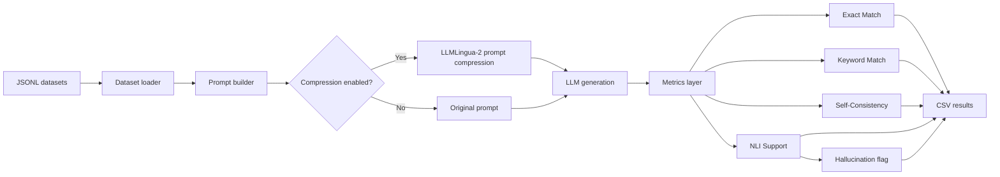
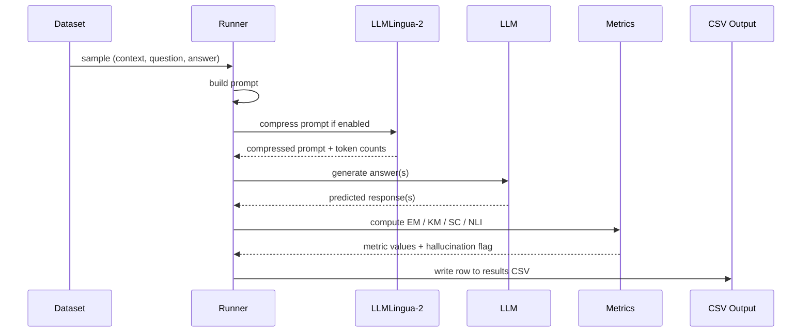

# LLM Hallucination Reduction with Prompt Compression

This project studies how prompt compression affects hallucination in large language models. The pipeline runs several LLMs on benchmark question-answering datasets, optionally compresses long prompts using LLMLingua-2, and measures the effect with correctness, consistency, and entailment-based metrics.

The core idea is simple: remove redundant prompt text, keep the relevant evidence, and check whether the model becomes more grounded in its answer generation.

## What This Project Does

The system:

1. Loads benchmark samples from four datasets.
2. Builds a prompt for each sample.
3. Optionally compresses that prompt with LLMLingua-2.
4. Generates one or more answers from multiple LLMs.
5. Scores each answer with Exact Match, Keyword Match, Self-Consistency, and NLI Support.
6. Writes the full experiment trace to CSV for later analysis and plotting.

## Repository Overview

### Models used in the main experiment

- `microsoft/Phi-3-mini-4k-instruct`
- `mistralai/Mistral-7B-Instruct-v0.2`
- `meta-llama/Llama-2-7b-chat-hf`
- `meta-llama/Meta-Llama-3-8B-Instruct`

### Datasets used

Each dataset subset contains 1,000 samples:

- `gsm8k_subset.jsonl`
- `squad_v2_subset.jsonl`
- `hotpotqa_subset.jsonl`
- `triviaqa_subset.jsonl`

### Main outputs

- `results/experiment_results_final.csv`
- `results/experiment_summary.csv`
- `results/plot_*.png`

There are also model-specific and long-context experiment files such as `tiny_long_experiment_results.csv` and `phi3_long_experiment_results.csv`.

## System Architecture



## Methodology

The experiment compares **uncompressed** and **compressed** prompts for the same sample. For each input:

- the original prompt is built from the dataset context and question,
- LLMLingua-2 may compress the prompt to a smaller token budget,
- the LLM answers both versions,
- the answers are scored using multiple complementary metrics.

This allows the project to separate two questions:

- Does compression change the answer quality?
- Does compression improve grounding and reduce hallucination on long prompts?

## Pipeline Design



## Implementation Details

### `src/dataset.py`

Reads JSONL files and yields samples with these fields:

- `id`
- `dataset`
- `context`
- `question`
- `answer`

### `src/models.py`

Loads three model families:

- the answer-generation LLMs,
- the NLI classifier (`roberta-large-mnli`),
- the sentence-transformer embedding model (`all-MiniLM-L6-v2`) for self-consistency.

It also includes GPU-aware loading, optional Hugging Face token support for gated models, and fallback behavior when memory is limited.

### `src/compression.py`

Uses LLMLingua-2 to compress prompts toward a fixed target token budget. If the compressor cannot be initialized, the pipeline falls back safely to the original prompt.

### `src/metrics.py`

Computes four metrics:

- **Exact Match**: compares the generated answer to the gold answer.
- **Keyword Match**: checks whether important gold keywords appear in the prediction.
- **Self-Consistency**: measures semantic agreement between multiple generated answers using cosine similarity over embeddings.
- **NLI Support**: measures how strongly the answer is entailed by the context.

### `src/runner.py`

Coordinates the full experiment, handles checkpoint-style resume, writes CSV rows, and produces aggregated summary statistics after execution.

## Metrics Explained

### Exact Match (EM)

Exact Match is a strict correctness score.

- For numeric tasks like GSM8K, the last numeric answer is extracted and compared.
- For text tasks, normalized text is compared directly.

Interpretation:
- `1.0` means the prediction exactly matches the reference.
- `0.0` means it does not.

### Keyword Match (KM)

Keyword Match is a looser correctness check.

- Stopwords are removed from the gold answer.
- The prediction is scored `1.0` only if all remaining gold keywords appear.

Interpretation:
- Useful when the model is semantically close but not word-for-word identical.

### Self-Consistency (SC)

Self-Consistency measures how similar multiple answers are to each other.

- Each generated answer is converted to an embedding.
- Pairwise cosine similarity is computed.
- The average similarity becomes the SC score.

Interpretation:
- Higher SC means the model is internally more stable.
- It does not directly measure factual correctness.

### NLI Support

NLI Support is the main hallucination proxy in this project.

- Premise: the dataset context
- Hypothesis: the model answer
- The NLI model estimates entailment probability

Interpretation:
- Higher NLI Support means the answer is better grounded in the provided evidence.
- Lower NLI Support means the answer is less supported and more likely to be hallucinated.

## Prompt Compression in This Project

Compression is controlled in `src/config.py`:

- `COMPRESSION_ENABLED = True`
- `COMPRESSION_THRESHOLD_TOKENS = 2000`
- `FORCE_COMPRESSION = True`

This means the pipeline always attempts compression, and LLMLingua-2 targets a 2,000-token budget.

Important note:

- The target is **static**.
- The actual achieved reduction is **dynamic** because it depends on the prompt length and content.

Compression is most useful for long, noisy prompts where the model has too much irrelevant context to process efficiently.

## Results and Findings

### Dataset-level summary from the long-context experiment

The repository contains long-context experiment outputs showing that compression helps most when prompts are long and redundant.

| Dataset | Mean NLI Support |
| --- | ---: |
| GSM8K | 0.1652 |
| HotpotQA | 0.1261 |
| SQuAD v2 | 0.4212 |
| TriviaQA | 0.0919 |

### TinyLlama long-context results

In the long-context TinyLlama run, compression behaved differently across datasets:

| Dataset | Before Compression | After Compression | Improvement |
| --- | ---: | ---: | ---: |
| HotpotQA | 0.1183 | 0.1259 | +6.42% |
| TriviaQA | 0.1263 | 0.1037 | -17.88% |
| Overall | 0.1223 | 0.1148 | -6.12% |

Takeaway:

- Compression can help on some long prompts by removing noise.
- It can also hurt when the compressed prompt removes useful evidence.
- The effect is therefore dataset- and prompt-dependent.

### Main multi-model experiment summary

The project also compares several LLMs under the same pipeline. The key research pattern is:

- smaller models benefit more from compression on long prompts,
- larger models already handle context better, so the gains are smaller,
- short prompts usually see little to no benefit.

## Why This Reduces Hallucinations

Prompt compression helps by improving the signal-to-noise ratio:

- irrelevant text is reduced,
- the model focuses on the most useful evidence,
- answer grounding improves,
- hallucination risk drops on long contexts.

This is why compression is most effective when prompts are long and cluttered, and least useful when prompts are already short and focused.

## Project Structure

```text
.
├── data/
│   ├── gsm8k_subset.jsonl
│   ├── squad_v2_subset.jsonl
│   ├── hotpotqa_subset.jsonl
│   └── triviaqa_subset.jsonl
├── results/
│   ├── experiment_results_final.csv
│   ├── experiment_summary.csv
│   ├── tiny_long_experiment_results.csv
│   ├── tiny_long_experiment_summary.csv
│   ├── phi3_long_experiment_results.csv
│   ├── phi3_long_experiment_summary.csv
│   └── plots and aggregation files
├── src/
│   ├── config.py
│   ├── dataset.py
│   ├── models.py
│   ├── compression.py
│   ├── metrics.py
│   └── runner.py
├── tests/
│   ├── test_all.py
│   ├── test_pipeline.py
│   ├── verify_setup.py
│   └── other validation tests
├── prepare_datasets.py
├── requirements.txt
├── setup.md
└── README.md
```

## Setup

### Prerequisites

- Python 3.10+ recommended
- CUDA-capable GPU for full runs
- Internet access for Hugging Face model downloads
- Hugging Face token with access to gated LLaMA models

### Install

```bash
git clone -b main https://github.com/Pratyay-Patel/Reduce-Hallucinations-in-LLMS.git
cd Reduce-Hallucinations-in-LLMS
python -m venv venv
venv\Scripts\activate
pip install -r requirements.txt
```

### Configure the Hugging Face token

Create a `.env` file in the project root:

```bash
HF_TOKEN=your_token_here
```

## Running the Project

### Verify setup

```bash
python tests/verify_setup.py
```

### Run the lightweight test suite

```bash
python tests/test_all.py
```

### Run the full pipeline

```bash
python -m src.runner
```

### Regenerate datasets

```bash
python prepare_datasets.py
```

## Configuration Notes

Key values live in `src/config.py`:

- `LLM_MODELS`: models used in the experiment
- `NLI_MODEL_NAME`: `roberta-large-mnli`
- `EMB_MODEL_NAME`: `sentence-transformers/all-MiniLM-L6-v2`
- `COMPRESSION_THRESHOLD_TOKENS`: 2000
- `SELF_CONSISTENCY_SAMPLES`: 1
- `RESULTS_PATH`: `results/experiment_results_final.csv`

## Validation and Testing

The project includes:

- environment verification
- Hugging Face model-access verification
- a CPU-safe smoke test of the pipeline

These tests help confirm that the repo is configured correctly before running a full GPU experiment.

## Key Practical Takeaways

- Prompt compression is not universally beneficial.
- It is most useful for long contexts with redundancy.
- Short prompts often see little benefit because there is less noise to remove.
- Smaller models usually benefit more than larger ones.
- NLI Support is the main signal for hallucination reduction in this project.

## License and Attribution

This repository is part of an academic experiment on hallucination reduction in LLMs. Add your preferred license text here if you want to publish the project publicly.


